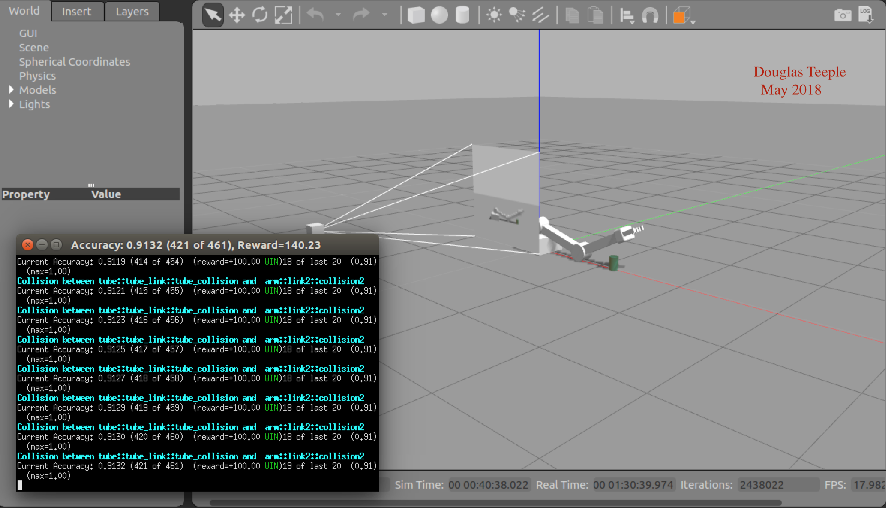

# Deep RL Arm Manipulation

This project is based on the Nvidia open source project "jetson-reinforcement" developed by [Dustin Franklin](https://github.com/dusty-nv). The goal of the project is to create a DQN agent and define reward functions to teach a robotic arm to carry out two primary objectives:

1. Have any part of the robot arm touch the object of interest, with at least a 90% accuracy.
2. Have only the gripper base of the robot arm touch the object, with at least a 80% accuracy.




## Building from Source (Nvidia Jetson TX2)

Run the following commands from terminal to build the project from source:

``` bash
$ sudo apt-get install cmake
$ git clone http://github.com/udacity/RoboND-DeepRL-Project
$ cd RoboND-DeepRL-Project
$ git submodule update --init
$ mkdir build
$ cd build
$ cmake ../
$ make
```

During the `cmake` step, Torch will be installed so it can take awhile. It will download packages and ask you for your `sudo` password during the install.

## Challenge Part 3

### 1. Object Randomization
In the project, so far, the object of interest was placed at the same location, throughout. For this challenge, the object will instantiate at different locations along the x-axis. Follow these steps and test your solution:

In PropPlugin.cpp, redefine the prop poses in PropPlugin::Randomize() to the following:

``` c++
pose.pos.x = randf(0.02f, 0.30f);
pose.pos.y = 0.0f;
pose.pos.z = 0.0f;
```

In ArmPlugin.cpp, replace ResetPropDynamics(); set in the method ArmPlugin::updateJoints() with RandomizeProps();

### 2. Increasing the Arm’s Reach
As you might have noticed in the gazebo-arm.world file, the arm’s base has a revolute joint. However, in the project, that was disabled to restrict the arm’s reach to a specific axis. In this challenge, the object’s starting location will be changed, and the arm will be allowed to rotate about its base. Follow these steps to try this challenge:

In gazebo-arm.world, modify the tube model’s pose to [0.75 0.75 0 0 0 0]
In ArmPlugin.cpp, set the variable LOCKBASE to false.
In ArmPlugin.cpp, replace RandomizeProps(); set in the method ArmPlugin::updateJoints() with ResetPropDynamics();

### 3. Increasing Arm’s Reach with Object Randomization
This challenge will build on top of the previous challenge:

In gazebo-arm.world, modify the tube model’s pose to [0.75 0.75 0 0 0 0]
In ArmPlugin.cpp, set the variable LOCKBASE to false.
In ArmPlugin.cpp, replace ResetPropDynamics(); set in the method ArmPlugin::updateJoints() with RandomizeProps();
In PropPlugin.cpp, redefine the prop poses in PropPlugin::Randomize() to the following:

``` c++
pose.pos.x = randf(0.35f, 0.45f);
pose.pos.y = randf(-1.5f, 0.2f);
pose.pos.z = 0.0f;
```
In PropPlugin.cpp in the onUpdate() function, add a small velocity so the cylinder moves:

``` c++
// Apply a small linear velocity to the model.
	this->model->SetLinearVel(math::Vector3(.03, 0, 0));
```

After making all these changes (I skipped directly to part 3) the best results I could get was an accuracy of 0.47:


For this challenge the paramters are:

``` c++
// Turn on velocity based control
static bool VELOCITY_CONTROL = true;
static float VELOCITY_MIN = -0.2f;
static float VELOCITY_MAX  = 0.2f;

// Define DQN API Settings

static bool ALLOW_RANDOM = true;
static bool DEBUG_DQN = false;
static float GAMMA = 0.9f;
static float EPS_START = 0.9f;
static float EPS_END = 0.05f;
static int EPS_DECAY = 200;

static int INPUT_WIDTH     = 64;
static int INPUT_HEIGHT    = 64;
static int INPUT_CHANNELS  = 3;
static const char *OPTIMIZER = "RMSprop";
static float LearningRate  = 0.1f;
static int REPLAY_MEMORY   = 10000;
static int BATCH_SIZE      = 64;
static bool USE_LSTM       = true;
static int LSTMSize        = 512;

// smoothing of delta
const float alpha = 0.05;	// 5% current dist, 95% historical average

```

In order to improve these results, I added a loop changing both learning rate from 0.05 to 0.45, and changing the LSTM size from 64, 128, 256, to 512. This plot shows the results:


So, what can we see from these graphs? Well:

1. LSTM size of 64 does not work.
2. LSTM size of 512 does not work.
3. LSTM size of 128 or 256 give similar results:
  * The best learning rate in both cases is 0.1, with an accuracy of 0.54 for LSTM-128 and 0.45 for LSTM-256.
  * Accuracy settling happens by 50 episodes and does not improve much up to 100 episodes.

Having the cylinder move from run to run causes issues for the learning accuracy since the robot tends to return to where it found the cylinder before. Instinctively, in order to learn in this new circumstance, the LSTM size should increase to accomodate the more complex task. So the next step is to set the learning rate to 0.1, the LSTM size to 512 and let the maximum number of episodes in a run extend into the thousands.


