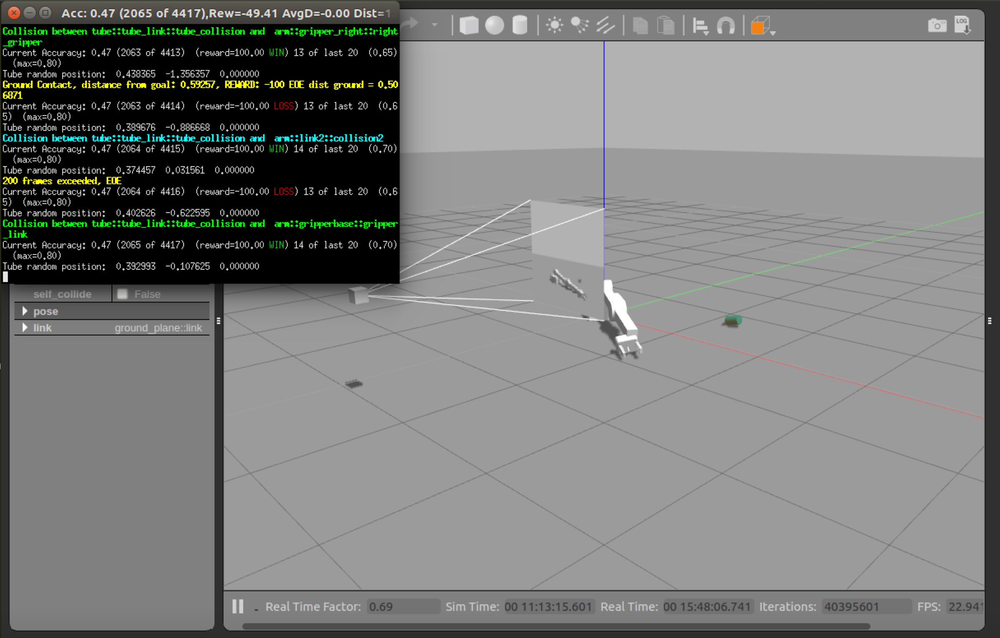
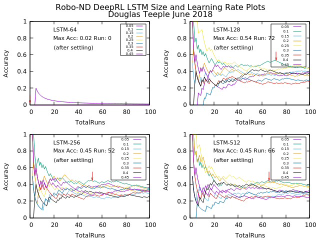
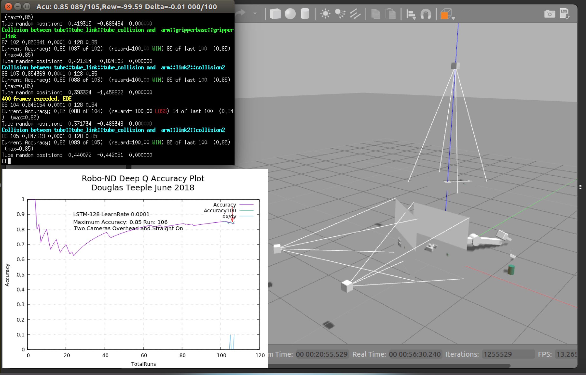
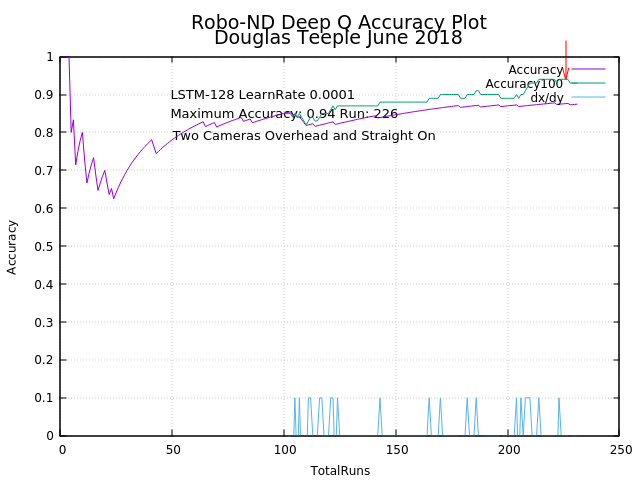
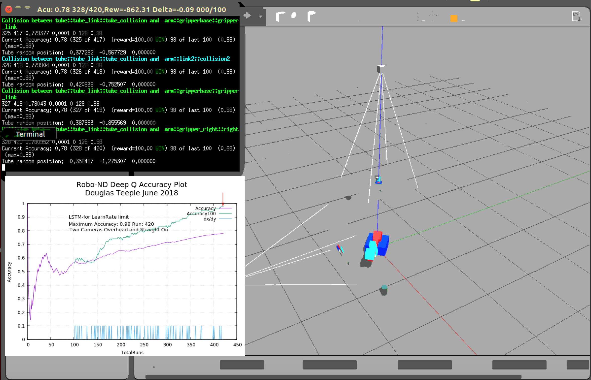
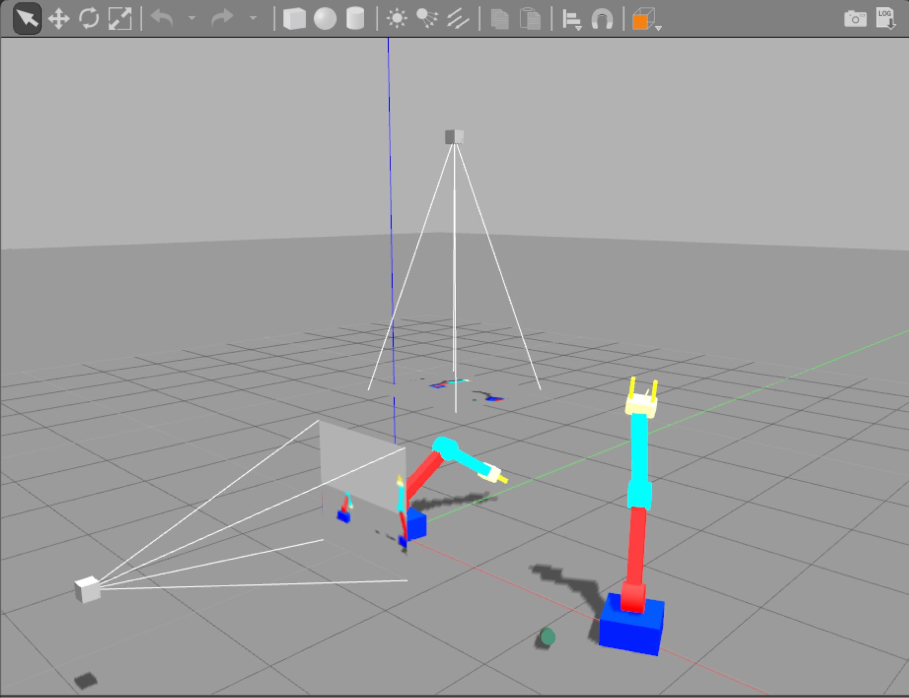

# Deep Q Reinforcement Learning Arm Manipulation

This project is based on the Nvidia open source project "jetson-reinforcement" developed by [Dustin Franklin](https://github.com/dusty-nv). The goal of the project is to create a DQN agent and define reward functions to teach a robotic arm to carry out two primary objectives:

1. Have any part of the robot arm touch the object of interest, with at least a 90% accuracy.
2. Have only the gripper base of the robot arm touch the object, with at least a 80% accuracy.


## Building from Source (Nvidia Jetson TX2)

Run the following commands from terminal to build the project from source:

``` bash
$ sudo apt-get install cmake
$ git clone http://github.com/udacity/RoboND-DeepRL-Project
$ cd RoboND-DeepRL-Project
$ git submodule update --init
$ mkdir build
$ cd build
$ cmake ../
$ make
```

During the `cmake` step, Torch will be installed so it can take awhile. It will download packages and ask you for your `sudo` password during the install.

## Running the Gazebo Simulation

The script `gazebo-arm.sh` in the root directory launches gazebo with the ArmPlugin in an xterm window. ArmPlugin colorizes events (green for gripper contact, cyan for arm contact, yellow for End Of Episode) and places a running accuracy for tracking incremental rewards. It also creates a log file `gazebo-arm.log` and a plot file `gazebo-arm.plt` which is used by the script `plot.sh` to create the plots below.

## The DQN Implementation

The DQN agent is a C++ wrapper for a Python pyTorch implementation of DQN described [here](https://pytorch.org/tutorials/intermediate/reinforcement_q_learning.html). I am quoting directly from the pytorch tutorial to gain a better understanding of how to approach Challenge 3.

Our environment is deterministic, so all equations presented here are also formulated deterministically for the sake of simplicity. In the reinforcement learning literature, they would also contain expectations over stochastic transitions in the environment.

Our aim will be to train a policy that tries to maximize the discounted, cumulative reward , where  is also known as the return. The discount, γ, should be a constant between 0 and 1 that ensures the sum converges. It makes rewards from the uncertain far future less important for our agent than the ones in the near future that it can be fairly confident about.

The main idea behind Q-learning is that if we had a function , that could tell us what our return would be, if we were to take an action in a given state, then we could easily construct a policy that maximizes our rewards:


However, we don’t know everything about the world, so we don’t have access to Q∗. But, since neural networks are universal function approximators, we can simply create one and train it to resemble Q∗.

For our training update rule, we’ll use a fact that every Q
 function for some policy obeys the Bellman equation:


The difference between the two sides of the equality is known as the temporal difference error, δ:


To minimise this error, we will use the Huber loss. The Huber loss acts like the mean squared error when the error is small, but like the mean absolute error when the error is large - this makes it more robust to outliers when the estimates of Q are very noisy. We calculate this over a batch of transitions, B, sampled from the replay memory:


 
Q-network

Our model will be a convolutional neural network that takes in the difference between the current and previous screen patches. It has two outputs, representing Q(s,left) and Q(s,right) (where s is the input to the network). In effect, the network is trying to predict the quality of taking each action given the current input.

```Python
class DQN(nn.Module):

    def __init__(self):
        super(DQN, self).__init__()
        self.conv1 = nn.Conv2d(3, 16, kernel_size=5, stride=2)
        self.bn1 = nn.BatchNorm2d(16)
        self.conv2 = nn.Conv2d(16, 32, kernel_size=5, stride=2)
        self.bn2 = nn.BatchNorm2d(32)
        self.conv3 = nn.Conv2d(32, 32, kernel_size=5, stride=2)
        self.bn3 = nn.BatchNorm2d(32)
        self.head = nn.Linear(448, 2)

    def forward(self, x):
        x = F.relu(self.bn1(self.conv1(x)))
        x = F.relu(self.bn2(self.conv2(x)))
        x = F.relu(self.bn3(self.conv3(x)))
        return self.head(x.view(x.size(0), -1))
```

### Training

#### Hyperparameters and utilities

This cell instantiates our model and its optimizer, and defines some utilities:

select_action - will select an action accordingly to an epsilon greedy policy. Simply put, we’ll sometimes use our model for choosing the action, and sometimes we’ll just sample one uniformly. *The probability of choosing a random action will start at EPS_START and will decay exponentially towards EPS_END. EPS_DECAY controls the rate of the decay.*

```Python
BATCH_SIZE = 128
GAMMA = 0.999
EPS_START = 0.9
EPS_END = 0.05
EPS_DECAY = 200
TARGET_UPDATE = 10

policy_net = DQN().to(device)
target_net = DQN().to(device)
target_net.load_state_dict(policy_net.state_dict())
target_net.eval()

optimizer = optim.RMSprop(policy_net.parameters())
memory = ReplayMemory(10000)


steps_done = 0


def select_action(state):
    global steps_done
    sample = random.random()
    eps_threshold = EPS_END + (EPS_START - EPS_END) * \
        math.exp(-1. * steps_done / EPS_DECAY)
    steps_done += 1
    if sample > eps_threshold:
        with torch.no_grad():
            return policy_net(state).max(1)[1].view(1, 1)
    else:
        return torch.tensor([[random.randrange(2)]], device=device, dtype=torch.long)

```

Here we can see...

### Training loop

Finally, the code for training our model.

Here, you can find an optimize_model function that performs a single step of the optimization. It first samples a batch, concatenates all the tensors into a single one, computes Q(st,at) and V(st+1)=maxa Q(st+1,a), and combines them into our loss. By defition we set V(s)=0 if s is a terminal state. We also use a target network to compute V(st+1) for added stability. The target network has its weights kept frozen most of the time, but is updated with the policy network’s weights every so often. This is usually a set number of steps but we shall use episodes for simplicity.

```Python
def optimize_model():
    if len(memory) < BATCH_SIZE:
        return
    transitions = memory.sample(BATCH_SIZE)
    # Transpose the batch (see http://stackoverflow.com/a/19343/3343043 for
    # detailed explanation).
    batch = Transition(*zip(*transitions))

    # Compute a mask of non-final states and concatenate the batch elements
    non_final_mask = torch.tensor(tuple(map(lambda s: s is not None,
                                          batch.next_state)), device=device, dtype=torch.uint8)
    non_final_next_states = torch.cat([s for s in batch.next_state
                                                if s is not None])
    state_batch = torch.cat(batch.state)
    action_batch = torch.cat(batch.action)
    reward_batch = torch.cat(batch.reward)

    # Compute Q(s_t, a) - the model computes Q(s_t), then we select the
    # columns of actions taken
    state_action_values = policy_net(state_batch).gather(1, action_batch)

    # Compute V(s_{t+1}) for all next states.
    next_state_values = torch.zeros(BATCH_SIZE, device=device)
    next_state_values[non_final_mask] = target_net(non_final_next_states).max(1)[0].detach()
    # Compute the expected Q values
    expected_state_action_values = (next_state_values * GAMMA) + reward_batch

    # Compute Huber loss
    loss = F.smooth_l1_loss(state_action_values, expected_state_action_values.unsqueeze(1))

    # Optimize the model
    optimizer.zero_grad()
    loss.backward()
    for param in policy_net.parameters():
        param.grad.data.clamp_(-1, 1)
    optimizer.step()
```

Below, you can find the main training loop. At the beginning we reset the environment and initialize the state Tensor. Then, we sample an action, execute it, observe the next screen and the reward (always 1), and optimize our model once. When the episode ends (our model fails), we restart the loop.

```Python
num_episodes = 50
for i_episode in range(num_episodes):
    # Initialize the environment and state
    env.reset()
    last_screen = get_screen()
    current_screen = get_screen()
    state = current_screen - last_screen
    for t in count():
        # Select and perform an action
        action = select_action(state)
        _, reward, done, _ = env.step(action.item())
        reward = torch.tensor([reward], device=device)

        # Observe new state
        last_screen = current_screen
        current_screen = get_screen()
        if not done:
            next_state = current_screen - last_screen
        else:
            next_state = None

        # Store the transition in memory
        memory.push(state, action, next_state, reward)

        # Move to the next state
        state = next_state

        # Perform one step of the optimization (on the target network)
        optimize_model()
        if done:
            episode_durations.append(t + 1)
            plot_durations()
            break
    # Update the target network
    if i_episode % TARGET_UPDATE == 0:
        target_net.load_state_dict(policy_net.state_dict())
```
... end of pyTorch tutorial.

So, what can we draw from this information? Well, the replay memory has a long memory, so if we switch tasks from the base project to Challenge 3, the replay will do what it did from the base project, which is to return to the last location of the cylinder. That is what we don't want.

## Challenge Part 3

### 1. Object Randomization
In the project, so far, the object of interest was placed at the same location, throughout. For this challenge, the object will instantiate at different locations along the x-axis. Follow these steps and test your solution:

In PropPlugin.cpp, redefine the prop poses in PropPlugin::Randomize() to the following:

``` c++
pose.pos.x = randf(0.02f, 0.30f);
pose.pos.y = 0.0f;
pose.pos.z = 0.0f;
```

In ArmPlugin.cpp, replace ResetPropDynamics(); set in the method ArmPlugin::updateJoints() with RandomizeProps();

### 2. Increasing the Arm’s Reach
As you might have noticed in the gazebo-arm.world file, the arm’s base has a revolute joint. However, in the project, that was disabled to restrict the arm’s reach to a specific axis. In this challenge, the object’s starting location will be changed, and the arm will be allowed to rotate about its base. Follow these steps to try this challenge:

In gazebo-arm.world, modify the tube model’s pose to [0.75 0.75 0 0 0 0]
In ArmPlugin.cpp, set the variable LOCKBASE to false.
In ArmPlugin.cpp, replace RandomizeProps(); set in the method ArmPlugin::updateJoints() with ResetPropDynamics();

### 3. Increasing Arm’s Reach with Object Randomization
This challenge will build on top of the previous challenge:

In gazebo-arm.world, modify the tube model’s pose to [0.75 0.75 0 0 0 0]
In ArmPlugin.cpp, set the variable LOCKBASE to false.
In ArmPlugin.cpp, replace ResetPropDynamics(); set in the method ArmPlugin::updateJoints() with RandomizeProps();
In PropPlugin.cpp, redefine the prop poses in PropPlugin::Randomize() to the following:

``` c++
pose.pos.x = randf(0.35f, 0.45f);
pose.pos.y = randf(-1.5f, 0.2f);
pose.pos.z = 0.0f;
```
In PropPlugin.cpp in the onUpdate() function, add a small velocity so the cylinder moves:

``` c++
// Apply a small linear velocity to the model.
	this->model->SetLinearVel(math::Vector3(.03, 0, 0));
```

After making all these changes (I skipped directly to part 3) the best results I could get was an accuracy of 0.47. Note that the notion of a success was relaxed a bit to mean *any part of the arm or gripper contacting the cylinder*.



For this challenge the paramters are:

``` c++
// Turn on velocity based control
static bool VELOCITY_CONTROL = true;
static float VELOCITY_MIN = -0.2f;
static float VELOCITY_MAX  = 0.2f;

// Define DQN API Settings

static bool ALLOW_RANDOM = true;
static bool DEBUG_DQN = false;
static float GAMMA = 0.999f;
static float EPS_START = 0.9f;
static float EPS_END = 0.05f;
static int EPS_DECAY = 200;

static int INPUT_WIDTH     = 64;
static int INPUT_HEIGHT    = 64;
static int INPUT_CHANNELS  = 3;
static const char *OPTIMIZER = "RMSprop";
static float LearningRate  = 0.1f;
static int REPLAY_MEMORY   = 10000;
static int BATCH_SIZE      = 32;
static bool USE_LSTM       = true;
static int LSTMSize        = 512;

// smoothing of delta
const float alpha = 0.1;	// 10% current dist, 90% historical average

actionJointDelta = 0.1f;
actionVelDelta   = 0.05f;	// TUNE was 0.1
maxEpisodeLength = 200;		// TUNE was 100

```

In order to improve these results, I added a loop changing both learning rate from 0.05 to 0.45, and changing the LSTM size from 64, 128, 256, to 512. This plot shows the results:



So, what can we see from these graphs? Well:

1. LSTM size of 64 does not work.
2. LSTM size of 128, 256 and 512 give similar results:
  * The best learning rate in both cases is 0.1, with an accuracy of 0.54 for LSTM-128 and 0.45 for LSTM-256 and LSTM-512.
  * Accuracy settling happens by 50 episodes and does not improve much up to 100 episodes.
  * LSTM-512 needed the maxEpisodes parameter changed to 400.

Having the cylinder move from run to run causes issues for the learning accuracy since the robot tends to return to where it found the cylinder before. Instinctively, in order to learn in this new circumstance, the LSTM size should increase to accomodate the more complex task. So the next step is to set the learning rate to 0.1, the LSTM size to 512 and let the maximum number of episodes in a run extend into the thousands.

I finally realized that one camera as given could never operate the base joint since it can't see from above. So I added another camera and combined the results:



I also set the learning rate very small: 0.0001, because the complex task requires longer learning times, and it tended to get stuck doing the hill climbing with smaller learning rates.

At one point the last 100 accuracy rate hit 94%!




With a colored arm the last 100 accurcay rate hit 98%!




Now, let's try something a little different. Two competing arms. Will they learn faster? Will they learn to cooperate?



